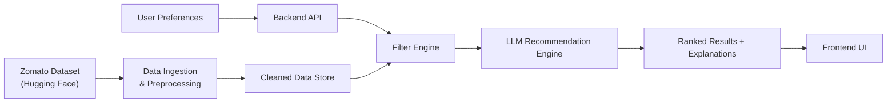
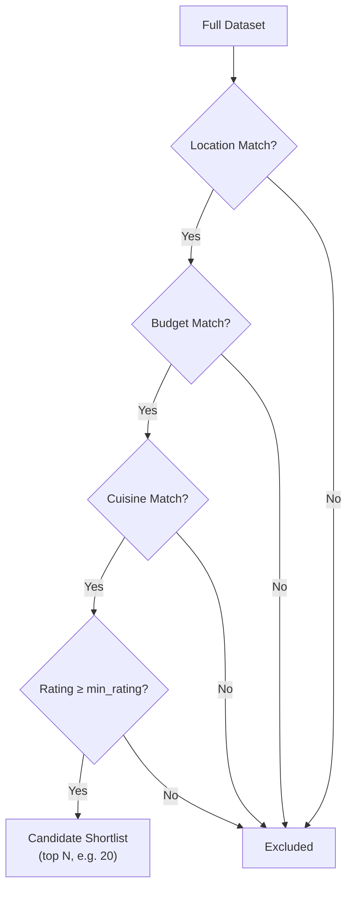
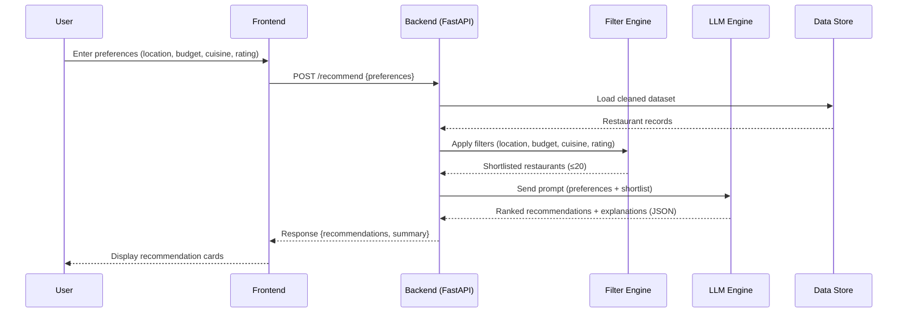

# Architecture: AI-Powered Restaurant Recommendation System

> **Source**: Derived from [context.md](file:///c:/Users/nagas/Downloads/zomato1/docs/context.md)

---

## 1. System Overview

The system is an AI-powered restaurant recommendation service inspired by Zomato. It combines a **structured restaurant dataset** (sourced from Hugging Face) with a **Large Language Model (LLM)** to deliver personalized, human-like restaurant suggestions based on user preferences such as location, budget, cuisine, and ratings.



---

## 2. High-Level Architecture

The application follows a **three-tier architecture**:

| Tier            | Responsibility                                          | Key Technologies                  |
| --------------- | ------------------------------------------------------- | --------------------------------- |
| **Presentation** | Collect user input, display recommendations             | HTML / CSS / JavaScript (Vite)    |
| **Application**  | Route requests, filter data, orchestrate LLM calls      | Python (FastAPI)                  |
| **Data**         | Store preprocessed restaurant records                   | Pandas DataFrame / SQLite / CSV   |

---

## 3. Component Breakdown

### 3.1 Data Ingestion Module

**Purpose**: Load the Zomato dataset from Hugging Face, clean it, and persist a preprocessed copy for fast runtime access.

| Aspect          | Detail                                                                                                                                       |
| --------------- | -------------------------------------------------------------------------------------------------------------------------------------------- |
| **Source**       | [ManikaSaini/zomato-restaurant-recommendation](https://huggingface.co/datasets/ManikaSaini/zomato-restaurant-recommendation)                |
| **Loader**      | `datasets` library (Hugging Face) or direct CSV download                                                                                     |
| **Preprocessing**| Normalize column names, handle missing values, parse cost/rating to numeric types, deduplicate entries, standardize cuisine & location names |
| **Output**       | Cleaned CSV / Parquet file **or** SQLite table ready for querying                                                                            |

```
data/
├── raw/                  # Original dataset download
│   └── zomato_raw.csv
├── processed/            # Cleaned & normalized
│   └── zomato_cleaned.csv
└── ingest.py             # Ingestion & preprocessing script
```

**Key Fields to Extract**:

| Field               | Type    | Example                    |
| -------------------- | ------- | -------------------------- |
| `restaurant_name`    | string  | "Barbeque Nation"          |
| `location`           | string  | "Koramangala, Bangalore"   |
| `cuisines`           | string  | "North Indian, Chinese"    |
| `average_cost_for_two`| float  | 1500.0                     |
| `aggregate_rating`   | float   | 4.2                        |
| `votes`              | int     | 350                        |
| `restaurant_type`    | string  | "Casual Dining"            |

---

### 3.2 User Input Module

**Purpose**: Collect and validate user preferences before passing them to the backend.

**Input Schema**:

```json
{
  "location": "Bangalore",
  "budget": "medium",
  "cuisine": "Italian",
  "min_rating": 3.5,
  "additional_preferences": "family-friendly, outdoor seating"
}
```

**Budget Mapping** (configurable):

| Label    | Cost Range (₹ for two) |
| -------- | ----------------------- |
| Low      | 0 – 500                |
| Medium   | 501 – 1500             |
| High     | 1501+                  |

**Validation Rules**:

- `location` — required; matched against known locations in the dataset
- `budget` — enum: `low`, `medium`, `high`
- `cuisine` — optional; fuzzy-matched against available cuisines
- `min_rating` — float between 0.0 and 5.0 (default: 3.0)
- `additional_preferences` — free-text; passed directly to the LLM prompt

---

### 3.3 Filter Engine (Integration Layer)

**Purpose**: Narrow down the full dataset to a shortlist of candidate restaurants matching the user's hard constraints.



**Design Decisions**:

- Filters are applied **sequentially** (location → budget → cuisine → rating) for clarity.
- If fewer than 3 results remain after filtering, relax constraints progressively (drop cuisine → widen budget → lower rating threshold) and inform the user.
- The shortlist is capped at **~20 restaurants** before being sent to the LLM to stay within token limits.

---

### 3.4 LLM Recommendation Engine

**Purpose**: Take the filtered shortlist and user preferences, then generate ranked recommendations with natural-language explanations.

#### Prompt Design

```text
You are a friendly restaurant recommendation assistant.

The user is looking for a restaurant with the following preferences:
- Location: {location}
- Budget: {budget}
- Cuisine: {cuisine}
- Minimum Rating: {min_rating}
- Additional Preferences: {additional_preferences}

Here are the matching restaurants:
{formatted_restaurant_list}

Please:
1. Rank the top 5 restaurants that best match the user's preferences.
2. For each restaurant, explain WHY it is a good fit.
3. Provide a brief summary at the end comparing the top picks.

Respond in JSON format:
{
  "recommendations": [
    {
      "rank": 1,
      "restaurant_name": "...",
      "cuisine": "...",
      "rating": ...,
      "estimated_cost_for_two": ...,
      "explanation": "..."
    }
  ],
  "summary": "..."
}
```

#### LLM Integration

| Aspect             | Detail                                                        |
| ------------------- | ------------------------------------------------------------ |
| **Provider**        | Groq API                                                     |
| **Model**           | `llama-3.3-70b-versatile` (fast, high-quality inference)     |
| **Temperature**     | 0.4 (balanced creativity + consistency)                      |
| **Max Tokens**      | ~1024 (sufficient for top-5 + summary)                       |
| **Fallback**        | If LLM call fails, return the filtered list sorted by rating |
| **Response Format** | Structured JSON for reliable frontend parsing                |

---

### 3.5 Output Display (Frontend)

**Purpose**: Present ranked recommendations in a visually appealing, user-friendly interface.

**Each Recommendation Card Shows**:

| Element                 | Source               |
| ----------------------- | -------------------- |
| Restaurant Name         | Dataset              |
| Cuisine                 | Dataset              |
| Rating (★)              | Dataset              |
| Estimated Cost for Two  | Dataset              |
| AI-Generated Explanation| LLM response         |

**UI Features**:

- Responsive card-based layout
- Star-rating visualization
- Budget indicator (₹ / ₹₹ / ₹₹₹)
- Collapsible AI explanation per card
- Summary section at the top comparing all picks
- Loading skeleton while awaiting LLM response

---

## 4. Project Directory Structure

```
zomato1/
├── docs/
│   ├── Problemstatement.txt
│   ├── context.md
│   └── architecture.md          ← this file
│
├── data/
│   ├── raw/                     # Original dataset
│   └── processed/               # Cleaned dataset
│
├── backend/
│   ├── main.py                  # FastAPI entry point
│   ├── config.py                # Settings & API keys (env-based)
│   ├── models/
│   │   └── schemas.py           # Pydantic request/response models
│   ├── services/
│   │   ├── data_loader.py       # Dataset loading & caching
│   │   ├── filter_engine.py     # Preference-based filtering
│   │   └── llm_engine.py        # LLM prompt construction & API call
│   └── utils/
│       └── preprocessing.py     # Data cleaning utilities
│
├── frontend/
│   ├── index.html               # Main HTML page
│   ├── styles/
│   │   └── index.css            # Global styles
│   └── scripts/
│       └── app.js               # Frontend logic & API calls
│
├── scripts/
│   └── ingest.py                # One-time data ingestion script
│
├── .env.example                 # Environment variable template
├── requirements.txt             # Python dependencies
└── README.md                    # Project overview & setup guide
```

---

## 5. Data Flow Diagram



---

## 6. API Design

### `POST /api/recommend`

**Request Body**:

```json
{
  "location": "Bangalore",
  "budget": "medium",
  "cuisine": "Italian",
  "min_rating": 3.5,
  "additional_preferences": "outdoor seating"
}
```

**Response Body**:

```json
{
  "recommendations": [
    {
      "rank": 1,
      "restaurant_name": "Toscano",
      "cuisine": "Italian",
      "rating": 4.5,
      "estimated_cost_for_two": 1200,
      "explanation": "Toscano is a top pick because..."
    }
  ],
  "summary": "Based on your preferences...",
  "filters_applied": {
    "location": "Bangalore",
    "budget_range": [501, 1500],
    "cuisine": "Italian",
    "min_rating": 3.5
  },
  "total_matches": 12
}
```

### `GET /api/meta/locations`

Returns distinct locations available in the dataset (for frontend dropdowns).

### `GET /api/meta/cuisines`

Returns distinct cuisines available in the dataset (for frontend dropdowns).

---

## 7. Technology Stack

| Layer         | Technology                            | Rationale                                      |
| ------------- | ------------------------------------- | ---------------------------------------------- |
| Frontend      | HTML + CSS + Vanilla JS               | Lightweight, no build tooling overhead         |
| Backend       | Python 3.11+ / FastAPI                | Async-first, auto-generated OpenAPI docs       |
| Data Handling | Pandas                                | Powerful filtering/aggregation on tabular data |
| LLM Provider  | Groq API                              | Ultra-low-latency inference, free tier available|
| LLM SDK       | `groq` Python SDK                     | Official client with async support             |
| Dataset       | Hugging Face `datasets` lib           | Simple one-liner loading                       |
| Config        | python-dotenv / `.env`                | Secure API key management                      |

---

## 8. Configuration & Environment

```env
# .env.example
GROQ_API_KEY=your-groq-api-key-here
LLM_MODEL=llama-3.3-70b-versatile
LLM_TEMPERATURE=0.4
LLM_MAX_TOKENS=1024
DATA_PATH=data/processed/zomato_cleaned.csv
TOP_N_RESULTS=5
MAX_SHORTLIST=20
```

---

## 9. Error Handling & Edge Cases

| Scenario                          | Handling Strategy                                                   |
| --------------------------------- | ------------------------------------------------------------------- |
| No restaurants match filters      | Progressively relax constraints; inform user of relaxation          |
| LLM API rate-limited / down       | Return filtered list sorted by rating as fallback                  |
| Invalid user input                | Return 422 with descriptive validation errors (Pydantic)           |
| Dataset not found at startup      | Auto-trigger ingestion script; fail gracefully with clear message   |
| LLM returns malformed JSON        | Retry once; if still broken, extract partial data or use fallback  |
| Very large shortlist (>20)        | Trim to top 20 by rating before sending to LLM                    |

---

## 10. Future Enhancements

- **Semantic Search**: Use embeddings (e.g., Sentence-BERT) for fuzzy cuisine/preference matching
- **User Profiles & History**: Store past queries for personalized re-ranking
- **Map Integration**: Show restaurant locations on an interactive map
- **Reviews Summary**: Use LLM to summarize user reviews per restaurant
- **Multi-language Support**: Serve recommendations in the user's preferred language
- **Caching Layer**: Cache frequent query patterns to reduce LLM API costs
